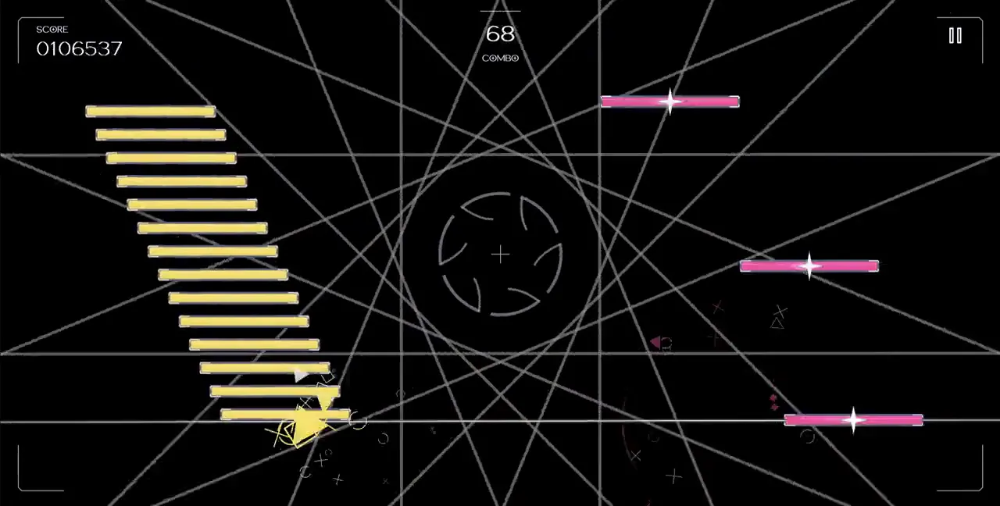
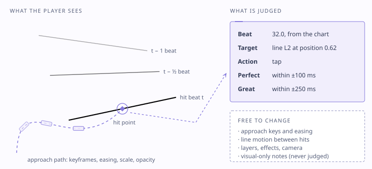
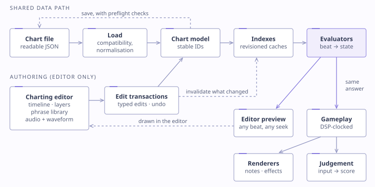

# Memora: A Rhythm Game

**Memora** is an independent rhythm game with a self-contained beatmap authoring environment, built in **Unity 6 and C#** for Android.

This repository explains the engineering behind the work but does not expose game assets as they are protected under copyright. This repository contains architecture notes, diagrams, a conceptual data model, clean-room pseudocode, and a small, tested Unity code sample.

[](https://dhk-developer.github.io/memora.html)

> Gameplay footage and a more robust write-up: **[dhk-developer.github.io/memora.html](https://dhk-developer.github.io/memora.html)**

---

## The core idea: What does Memora build upon?

### 1) What is a rhythm game? 

A rhythm game is a type of gaming genre where you play along to a piece of music by hitting notes at the moment they reach a marker on the screen. The notes are usually placed to match the backing song, so hitting them in time makes up the core gameplay loop. Well-known examples include games such as Dance Dance Revolution, Guitar Hero and Osu!

Most rhythm games share a handful of ideas, and Memora uses all of them:

- **Notes and charts.** Each song has a chart (sometimes called a beatmap), which lists every note, the beat it falls on and the kind of input it expects. On a touch screen (such as a phone or a tablet), notes would be defined as clickable objects that travel to / need to be registered at a judgement point indicated by the song.
- **The judgement line.** Notes travel towards a line or target on the screen, and the moment a note reaches it is usually mapped to specific beats in a song, and is the exact time which the note needs to be tapped.
- **Timing windows.** The game measures how far your input was from the exact beat and grades it. This is usually measured in milliseconds, and are grouped in tags such as 'Perfect Hit', 'Great', 'Bad', 'Miss'
- **Score and combo.** Accurate hits raise your score, and hitting notes one after another without a miss builds a combo.
- **Staying in sync with the audio.** Everything depends on the game knowing exactly where it is in the song. Games such as these usually have calibration systems in place to regulate latency from hardware.

### 2) Where Memora comes from

In older rhythm games the notes scroll down fixed lanes towards a line that stays put. Games like Phigros changed that by letting the judgement lines themselves move, rotate, fade in and out and change speed during a song, so a chart becomes something closer to a choreographed music video. Arcaea mixes ordinary lanes with notes that you trace through the air. Memora starts from the moving-line idea, and like those games it's built for a touch screen, with the same tap, hold, slide and flick inputs.

Memora takes the moving-line idea further in a few directions:

- **Notes that aren't tied to a line.** A note can float in open space instead of travelling along a line.
- **Notes that aim at other things.** A note can fly towards another note, or towards a point on the screen that's still moving when you hit it. The game works out where that target will be at the moment the incoming note is due, instead of where it was earlier.
- **A unique presentation style resembling mini Deco picture films** - The game-field of a typical rhythm game is usually static. Memora expands this by swapping between pictures, or 'memories' that are held within photographs on a deco film.
- **Choreography that can't affect the score.** Lines, camera movement, layers and effects are all animated to the music, and none of them is allowed to change where or when a note is judged. The next section explains how.

Making all of that work while keeping every note fair to play is what led to the main design decision in Memora, which is to keep the data that decides the score completely separate from the data that decides how a note looks.



Every playable note has two layers that never write to each other:

- a **judgement contract**: beat, target and action, which input is compared against;
- **presentation**: how it enters, moves, scales, fades and leaves, authored as keyframes in beats.

Decorative systems (layers, camera, effects) are applied *after* judgement geometry is resolved, so they can't move a scoring target. That one rule is what makes ambitious choreography safe.

## Engineering highlights

| Problem | Approach | Read more |
|---|---|---|
| Gameplay must stay locked to audio | Song time from the audio **DSP clock**, all state **sampled at the beat**, per-device **latency calibration** with an outlier-resistant estimate | [timing-and-judgement.md](docs/timing-and-judgement.md) |
| Notes that aim at moving things | Targets can be lines, free points, **other notes** (sampled at *this* note's beat) or moving authored points; **predictive** and **adaptive** approach with stateless teleport correction | [gameplay-system.md](docs/gameplay-system.md) |
| An editor that can stand anywhere in the song | **Shared evaluators** for runtime and preview, interval-tree lifetime indexes, compact repeat schedules, latest-request-wins seeking | [editor-system.md](docs/editor-system.md) |
| Reusable phrases without fragile references | Presets **compile** to independent records: ID remapping, typed parameters, ports, one undo step, **version pinning** | [editor-system.md](docs/editor-system.md#phrase-presets) |
| Editor slowed on large charts | Profiled: whole-chart serialisation on every repaint. Fixed with edit transactions and per-pass caches. **Mean repaint 119.8 → 14.9 ms** on the densest chart, verified by 18,125 parity checks | [performance.md](docs/performance.md) |
| Old charts and saves must keep working | Compatibility contracts, dormant legacy fields, save preflight, **checksummed atomic saves** | [data-model.md](docs/data-model.md) |



## Repository map

```text
docs/
  architecture.md          System overview and boundaries
  gameplay-system.md       Judgement contract, targets, approach modes, input, scoring
  timing-and-judgement.md  DSP clock, windows, latency calibration
  editor-system.md         Custom editor, seeking, phrase presets
  data-model.md            Conceptual chart and save model
  performance.md           A measured optimisation, with before/after data
  technical-decisions.md   Problem → options → decision → trade-off
  development-history.md   How the system evolved
diagrams/                  SVG diagrams used above (light and dark aware)
examples/
  conceptual-chart.json    A small chart in the conceptual model
  pseudocode/              Clean-room pseudocode for the key algorithms
media/                     Gameplay and editor stills (footage on the portfolio page)

Runtime/  Editor/  Tests/  Samples/  Resources/
                           Small Unity/C# reference implementation (see below)
```

## Reference implementation (Unity / C#)

A compact, framework-light sample written for this repository that demonstrates some of the principles above in runnable form.

- `Runtime/Audio/ScheduledBeatClock.cs`: DSP-scheduled playback and beat reporting
- `Runtime/Timing/BeatMath.cs`, `InputJudge.cs`: beat/second conversion and configurable judgement windows
- `Runtime/Scoring/ScoreAccumulator.cs`: a one-million-point accuracy + combo model
- `Runtime/Visuals/ApproachTimeline.cs`, `ApproachPoseResolver.cs`, `DeterministicTrajectory.cs`: keyframed, beat-domain approach presentation with post-hit persistence and deterministic motion
- `Runtime/Validation/ChartValidator.cs`: validation of a compact chart model
- `Runtime/Performance/ComponentPool.cs`: a reusable component pool
- `Tests/EditMode/`: NUnit edit-mode tests for the maths, timeline, scoring and validation

**Try it:** create a Unity project (2022.3 LTS or newer) and copy `Runtime/`, `Editor/`, `Tests/`, `Samples/` and `Resources/` into a folder under `Assets/`, for example `Assets/RhythmShowcase/`. Run the Edit Mode tests from the Test Runner. **Window → Rhythm Showcase → Validate Sample Chart** validates the included JSON.


**NOTE:** Production source, charts, editor tooling, story content, character art, music and release configuration. Illustrative material is labelled *"Simplified conceptual representation. Not production source code."*

## Author

**Dae Kang**, sole designer and developer of Memora.
[Portfolio](https://dhk-developer.github.io) · [LinkedIn](https://www.linkedin.com/in/daehurn-kang-003650209) · [GitHub](https://github.com/dhk-developer)

© 2026 Daehurn Kang. All rights reserved. See [LICENSE](LICENSE).
