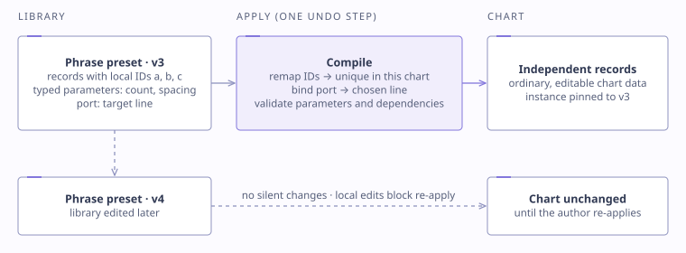

# Editor system

> Conceptual description. The editor's source is private.

## What the author works with

A custom Unity editor window with:

- **Timeline and object tree.** Objects (lines, points, cues, frames, visual sources, the aperture) group their tracks: lifetime, motion, appearance, parameter automation and layers. The tree follows the playhead by default (±4 beats) and can pin a selection.
- **Gamefield preview.** It draws the exact state at the current beat using the runtime's evaluators. Clicking selects lines and notes, and Alt-click reaches through overlapping objects.
- **Audio.** Waveform, offset and timing assist, plus **pitch-preserving slowed playback** for inspecting dense passages.
- **Layers dock.** Ordered, named, mutable modifiers on visual sources.
- **Phrase library.** Reusable, parameterised passages. See below.
- **Undo.** Typed edit transactions for ordinary edits, and whole-document snapshots only for structural operations.

## Standing anywhere in the song

The central requirement: scrub to beat 296 and see exactly what the player will see, without replaying from the start.

| Technique | Purpose |
|---|---|
| Shared evaluators | The preview calls the same *(chart, beat) → state* functions as gameplay, so there's no second approximation to drift. |
| Interval tree over lifetimes | "What's active at this beat?" without scanning the chart. Overlap queries never truncate. |
| Compact repeat schedules | Repeated events are stored once and expanded only for the queried window. |
| Cached scroll-distance integral | Variable scroll speed becomes distance, prepared per horizon and invalidated by timing edits. |
| Latest-request-wins seeking | A new seek supersedes pending work, and only a *complete* prepared result is published, never half a list. |
| Scoped invalidation | An edit invalidates only the caches it affects. Full-chart serialisation never happens on repaint. |

See [examples/pseudocode/interval-query.md](../examples/pseudocode/interval-query.md).

## Phrase presets

Applying a preset **compiles** it into ordinary chart records:

- internal IDs are remapped to be unique in the target chart;
- external references go through named **ports** bound to chosen lines;
- numeric parameters are whitelisted and typed, and recipes can't execute code;
- the apply is **one undo step**;
- the instance is **pinned** to the preset version, so later library edits never change a finished chart. Re-applying is explicit, and refused if the copy was edited locally.

See [examples/pseudocode/preset-compile.md](../examples/pseudocode/preset-compile.md).

## Why IMGUI stayed

Unity recommends UI Toolkit for new editor UI. Profiling showed the real costs here were serialisation, invalidation and lookups, not the UI framework, so a rewrite would have added risk without removing those costs. See [performance.md](performance.md).

## Story editor

A separate editor builds narrative episodes and compiles them to Yarn Spinner bytecode with a content hash. References are validated before anything reaches the reader. Deleting an episode first checks for incoming continuations, prerequisites and rewards.
