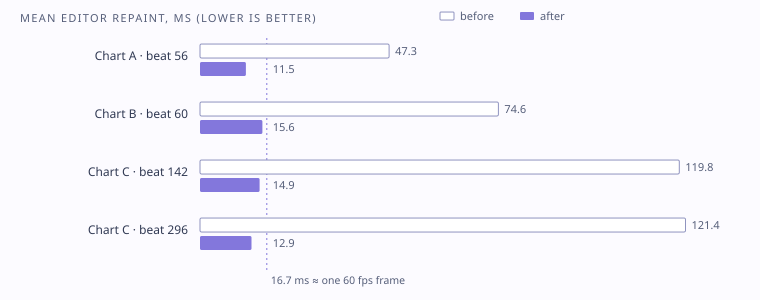

# Performance: a measured editor fix

## Symptom

Editor playback became sluggish on larger charts. On the densest section the gamefield preview updated about **5 times a second**.

## Diagnosis

Profiling pointed to the inspector, not rendering. It was **serialising the entire chart four times on every layout pass and four more times on every repaint**, to take undo snapshots even when nothing was being edited. Repeated frame projection, line classification and timeline grouping added more cost.

## Fix

1. Move inspector fields onto **typed edit transactions**. A full undo snapshot is now taken only for a real edit, and continuous drags keep their existing undo and cancel behaviour.
2. **Cache poses, camera samples and playfield projection within a GUI pass.** Invalidate them on beat, viewport, document or reduced-motion changes.
3. **Rebuild timeline lanes only on edits, load or undo**, and don't submit off-screen rows for drawing.
4. **Reuse line classification and event grouping** until the document, viewport, focus or selection changes.

Gameplay evaluators, geometry and chart data were deliberately left untouched.

## Results

Measured at 1× audio playback on an 1800 × 980 editor, with 2 s of warm-up and 8 s of measurement per section, and the heaviest panels open:

| Section (start beat) | Preview updates/s before | after | Mean repaint before | after |
|---|---:|---:|---:|---:|
| Chart A (56) | 14.8 | 59.6 | 47.3 ms | 11.5 ms |
| Chart B (60) | 9.6 | 56.1 | 74.6 ms | 15.6 ms |
| Chart C (142) | 4.6 | 55.0 | 119.8 ms | 14.9 ms |
| Chart C (296) | 5.0 | 66.5 | 121.4 ms | 12.9 ms |

These are section averages, not a guarantee for every chart or machine. The allocation counter returned zero throughout, so **no allocation-reduction figure is claimed**.

## Proving nothing changed

- 18,125 automated checks compared cached and fresh results across seeks, three aspect ratios (16:9, 20:9, 4:3), camera edits, undo and redo, and selection changes.
- Six editor screenshots at identical beats were **pixel-identical** before and after.
- SHA-256 hashes confirmed that no chart file changed.

## Other performance decisions

- Per-frame work never scans the whole chart. Interval indexes answer "what's active now".
- Decorative pools grow dynamically instead of silently capping output. Initial growth can allocate, and I document that rather than hide it.
- Music-reactive visuals read original PCM at chart time through a bounded FFT window cache, not the live output spectrum.

## Not yet measured

Frame times on target mobile devices. That's the next measurement, not an assumption.
