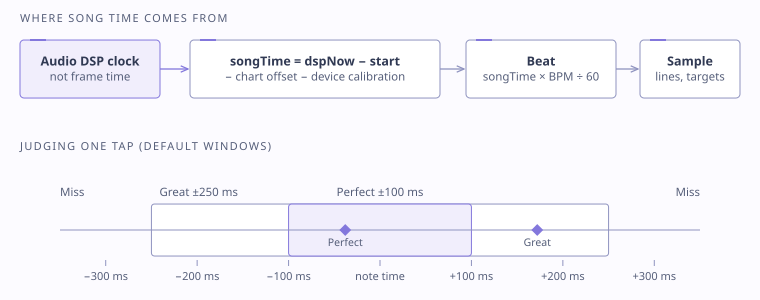

# Timing and judgement

> Simplified conceptual representation. Not production source code.



## Song time from the audio clock

Frame time drifts from audio and jitters with frame rate, so gameplay time is derived from the audio system's DSP clock:

```
start      = dspNow + preRoll          // song scheduled to start here
songTime   = dspNow − start − chartOffset − deviceOffset
beat       = songTime × bpm / 60
```

- The song is *scheduled* on the audio clock rather than started immediately, which gives a deterministic pre-roll.
- Pausing freezes `songTime`. Resuming reschedules.
- Line poses, targets and presentation are **sampled at the beat**, never integrated frame to frame. A dropped frame can't knock a line off course.

The [reference implementation](../Runtime/Audio/ScheduledBeatClock.cs) in this repository shows the scheduled-start idea in isolation.

## Judgement windows

Defaults (tunable per chart): **Perfect ±100 ms**, **Great ±250 ms**, otherwise Miss. Flicks use their own window.

## Measuring device latency

Every phone, headset and TV adds output delay. Calibration plays a continuous four-beat loop and asks for four taps on the accent:

1. Each tap is matched to its nearest accent on the DSP clock. Taps outside the acceptance window are ignored, and so is a second tap on the same accent (a double finger).
2. With four deltas collected, sort them and take the **mean of the middle two**, so one stray tap can't dominate.
3. Check reliability using the median absolute deviation and the gap between the middle pair. Two conflicting clusters mean *retry*, not *save*.

See [examples/pseudocode/calibration.md](../examples/pseudocode/calibration.md).

## Why this matters

The requirement was "the saved offset reflects the player's intent, not their worst tap". Writing it down first, including what counts as reliable and what forces a retry, made the algorithm straightforward and testable.

## Limits

Single BPM per chart. Variable tempo (a tempo map) is **deliberately deferred**. It needs one invertible clock shared by playback, grid, waveform and judgement, and approximating it with scroll-speed changes would corrupt judgement.
